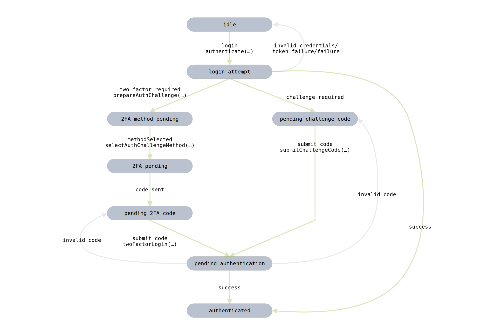

## Login Flows

> **Note:** This page is still a work-in-progress. You can help complete the documentation by contributing to the project.

#### HIGH LEVEL LOGIN FLOW

#### LOGIN FLOW OVERVIEW

Instagram has a rather complicated login flow. This is primarily due to the complex security measures in place to ensure that a user is correctly being authenticated. This SDK provides the requisite functions to allow a user to be authenticated when presented with both 2FA and *"Suspicious login"* prompts.

The private API relies on a number of additional factors to determine the authenticity of a login. The most influential is perhaps the **User Agent** of the device that is being used. The SDK handles the construction of the User Agent which should, on most devices, prevent a user from entering the `pending_challenge_code` state.

The state chart above describes the states and events that the flow is comprised of. The states generally correspond to input events that are pending from the user.

